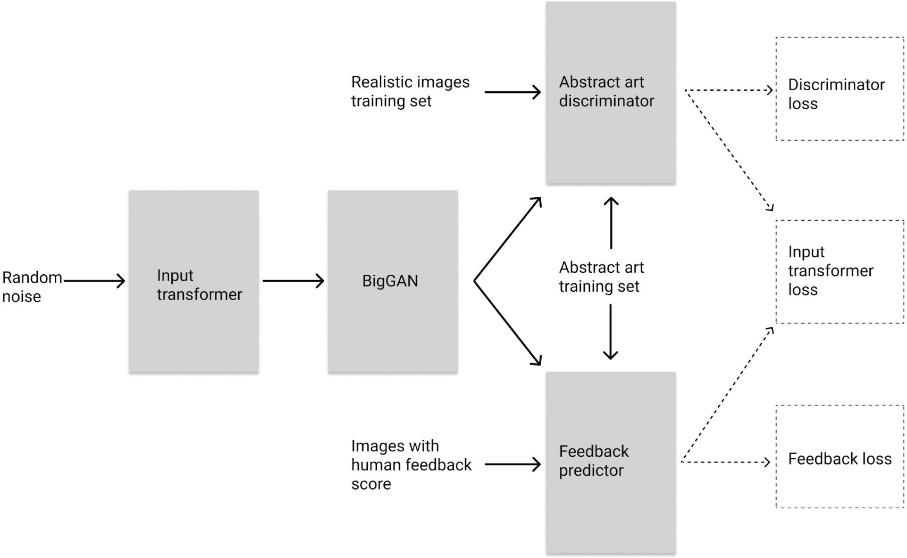

# CC-Art-Critics
Group project for the Computational Creativity course at the University of Helsinki (autumn 2020). "The Art Critics" group consists of Juuso Lassila and Kimmo Kallonen.

We present a computationally creative system for generating abstract artworks with the help of a [pre-trained BigGAN](https://github.com/huggingface/pytorch-pretrained-BigGAN). The architecture of the system is shown below.



The system is composed of four connected modules:
1. Input transformer
2. Generator (BigGAN)
3. Abstract art discriminator
4. Feedback predictor

The input space of the BigGAN is explored with the help of the input transformer. The goal of the input transformer is to simultaneously maximize the abstractness of the generated images, as evaluated by the abstract art discriminator, and the predicted feedback of an "art critic", as evaluated by the feedback predictor.

## Shortcut: Quick image generation

It is possible to skip the full training procedure and to just quickly demo the system and generate images with pre-trained models. To do this, first initialize the project as described in Step 1 below, then launch a Jupyter Notebook server with the command `jupyter notebook`, and finally execute the `art_generator_example.ipynb` notebook.

## Full procedure:

#### Step 1 - Initialization

Clone the repository and install the required packages.
```
git clone https://github.com/kimmokal/CC-Art-Critics
```

It is advisable to create a Python 3 virtual environment in which to install the packages.
```
pip install -r requirements.txt
```

### Step 2 - Download the training data set

Download and unzip the training data set in the repository's root directory for the correct directory structure.

```
wget -O art-critics-dataset.zip "https://www.dropbox.com/s/i7dsjnp3kzcaiu5/art-critics-dataset.zip?dl=1"
unzip art-critics-dataset.zip
```

The .zip file contains 3566 images in 512x512 resolution. Half of the images belong to the "abstract" category and the other half to "realistic". The abstract images were downloaded from [Unsplash](https://unsplash.com/), while the realistic images were randomly sampled from the [ImageNet](http://www.image-net.org/) data set.

**Note:** This Dropbox download link will be removed by 02/2021.

### Step 3 - Give ratings to the abstract images

Each image in the training set belonging to the "abstract" category is given a rating from 0 to 5. 

```
python give_feedback.py
```

The script asks for integer values between 0 and 5, and giving any other value as an input exits the script. It will write the ratings to a file, which is by default named `art_ratings.csv`. The script will check which images have been rated and won't show them again, so it is possible to interrupt and continue the process.

**Note:** Giving ratings to all 1783 "abstract" category images is very time consuming, and hence an example file `art_ratings_example.csv` is provided with all the images already rated. Rename the file as `art_ratings.csv` and you can move on to the next step.

### Step 4 - Train the abstract art discriminator

The training of the different modules are in separate Jupyter Notebooks. Launch the Notebook server.

```
jupyter notebook
```

To train the abstract art discriminator, run `abstract_image_discriminator_training.ipynb`.<br/>
It gives a score from 0 to 1 based on the abstractness of the image. It is possible to train the networks with a CPU, but it can be painfully slow. Training the networks with a GPU is highly recommended. The architecture of the network is defined in `image_regressor_model.py`.

### Step 5 - Train the feedback predictor

To train the feedback predictor, run `feeback_predictor_training.ipynb`.<br/>
The architecture of the feedback predictor is the same as the abstract art discriminator, with the difference that the sigmoid output is multiplied by 6 extending it's output range to [0,6]. Hence it is possible for the system to produce images for which the feedback predictor gives higher rating than any image in the training set was originally given.

### Step 6 - Train the input transformer

To train the input transformer, run `input_transformer_training.ipynb`.<br/>
The input transformer takes in a noise vector and transforms it to a suitable input for the BigGAN. The goal of the input transformer is to find areas in the BigGAN's input parameter space in which the generated images have maximal values for both abstractness and predicted feedback. Its architecture is defined in `input_transformer.py`.

### Step 7 - Generate images

After the all the modules have been trained, new abstract images can be generated with `art_generator.ipynb`.
